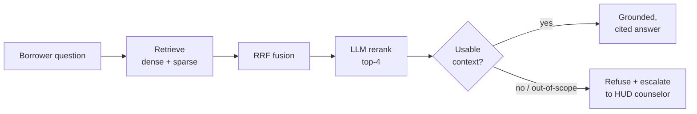

# 🏠 Mortgage Servicing & Compliance Co-Pilot

A Retrieval-Augmented Generation (RAG) assistant that answers a homeowner's
plain-language questions about their **mortgage-servicing rights** — grounded in
public federal (CFPB) rules, with **page-level citations** and a
**refusal-and-escalate** path to a HUD-approved housing counselor.

> ⚠️ **Disclaimer:** This tool provides **general information** from federal
> mortgage servicing rules — **not legal advice**. Questions that need legal
> advice, state-specific law, or personal account details are routed to a free
> HUD-approved housing counselor ([hud.gov](https://www.hud.gov)).

Built for the *Mastering Agentic AI* bootcamp (Week 2). The corpus is
deliberately **public** (the CFPB Mortgage Servicing Small Entity Compliance
Guide), so the project is fully shareable with no proprietary data.

---

## What it does

A borrower who has fallen behind on payments can ask, in their own words —
*"Can they foreclose while my loss-mitigation application is pending?"* — and get
a grounded, cited answer drawn straight from the rules. Anything that crosses
into legal advice or a borrower's specific account is declined and handed off to
a human counselor.

The hard part of a compliance tool isn't answering — it's knowing **when not
to**. This build treats that boundary as a first-class feature.

---

## Architecture



**Ingestion (one-time)**
1. **Table-aware parsing** — per page, detect and validate real tables, render
   them to Markdown, and subtract their bounding boxes from the prose so nothing
   is duplicated.
2. **Cleaning + reconciliation** — NFKC normalization and a tightly-scoped
   footer filter; a source-vs-target word-count check confirms only boilerplate
   was removed (100% → 97% coverage).
3. **Chunking experiment** — fixed-size vs. semantic chunking, with tables kept
   atomic (one table = one chunk).
4. **Embed + index** — Qwen3-Embedding-8B via Nebius into a persistent **Chroma**
   collection (dense) plus a **BM25** index (sparse). Embeddings are cached, so
   re-runs are free.

**Query (per request)**
1. Embed the question via Nebius.
2. Retrieve in parallel: Chroma (dense, top-20) + BM25 (sparse, top-20).
3. Fuse with **Reciprocal Rank Fusion**.
4. **Rerank** the fused top-20 → top-4 with an LLM listwise reranker (Nebius has
   no cross-encoder rerank endpoint).
5. **LangGraph** spine: answer only from the retrieved chunks with page
   citations — or refuse and escalate.

---

## Key features

- **Hybrid retrieval** — dense embeddings catch paraphrase; BM25 catches exact
  section numbers (§1024.41), day counts, and dollar thresholds.
- **Table-aware ingestion** — regulatory tables (timelines, fee conditions) stay
  intact instead of being split mid-row.
- **LLM-as-reranker** — a listwise reranker on Nebius, hardened against
  reasoning-model output, with a graceful fall back to fusion order.
- **Refusal-and-escalate spine** — discriminates by *question type*: a
  legal-advice question is declined even when relevant chunks are retrieved.
- **Page-level citations** — every claim is tied to a source page, e.g.
  *(CFPB Servicing Guide, p.174)*.

---

## Tech stack

| Component | Tool |
| --- | --- |
| Orchestration | LangGraph |
| Embeddings | Qwen3-Embedding-8B via Nebius |
| Vector DB (dense) | Chroma (local, persistent) |
| Sparse index | BM25 (`rank_bm25`) |
| Reranker | LLM listwise rerank (Qwen3.5 via Nebius) |
| Generation | Qwen3.5 via Nebius |
| Frontend | Streamlit |
| Corpus | CFPB Mortgage Servicing rules (public) |

---

## Repository structure

```
.
├── app.py                 # Streamlit chat app
├── config.py              # central settings (model IDs, paths, top-k)
├── requirements.txt
├── src/
│   ├── ingest.py          # table-aware PDF -> blocks.jsonl
│   ├── chunk.py           # fixed vs semantic chunking
│   ├── embed_index.py     # Chroma (dense) + BM25 (sparse) indexes
│   ├── retrieve.py        # hybrid retrieval + RRF + LLM rerank
│   └── answer.py          # LangGraph answer + refusal spine
└── data/
    └── raw/               # source PDF + SOURCES.md
```

---

## Setup & running

```bash
# 1. environment (Python 3.12)
python3 -m venv .venv && source .venv/bin/activate
pip install -r requirements.txt

# 2. add your Nebius key
cp .env.example .env        # then edit .env and set NEBIUS_API_KEY

# 3. build the knowledge base (one-time)
python src/ingest.py
python src/chunk.py                 # fixed
python src/chunk.py --semantic      # semantic
python src/embed_index.py --strategy fixed
python src/embed_index.py --strategy semantic

# 4a. ask from the command line
python src/answer.py --strategy semantic \
  --query "Can they foreclose while my loss mitigation application is pending?"

# 4b. or launch the chat app
streamlit run app.py
```

---

## Example

**Answerable question** →

> *Q: Can they foreclose while my loss-mitigation application is pending?*
>
> A grounded answer citing §1024.41 protections with page references
> *(CFPB Servicing Guide, p.172 / p.174)*.

**Out-of-scope question** →

> *Q: Should I file for bankruptcy to stop my foreclosure?*
>
> Declined and escalated to a HUD-approved housing counselor — legal advice is
> outside the tool's scope, even though relevant chunks were retrieved.

---

## Evaluation

> **Status: planned.** A gold set of ~12–15 borrower questions (answerable,
> ambiguous, and unanswerable/out-of-scope) will measure retrieval recall,
> faithfulness, answer relevance, and refusal accuracy, comparing the fixed vs.
> semantic indexes. Numbers will be added when the eval is run.

---

## Known limitations & roadmap

- **Two-column / sidebar pages** can interleave on a minority of pages; column
  detection is future work.
- **Single-source corpus** today (the CFPB guide); roadmap adds Regulation X
  (eCFR), Fannie/Freddie servicing guides, and HUD handbooks.
- **Reasoning-model cost/latency** — a non-reasoning generation model would be
  cheaper and faster.
- **Graph + vector retrieval** for multi-hop across cross-referenced sections is
  a future extension.

---

## Cost

Built within a **$1 Nebius trial credit**. Embeddings are cached (paid once);
Chroma, BM25, and Streamlit are free/local. Full ingest + demo runs in the
range of **$0.20–0.50**.

---

*This is a learning project. It is not affiliated with the CFPB or HUD and does
not provide legal advice.*
